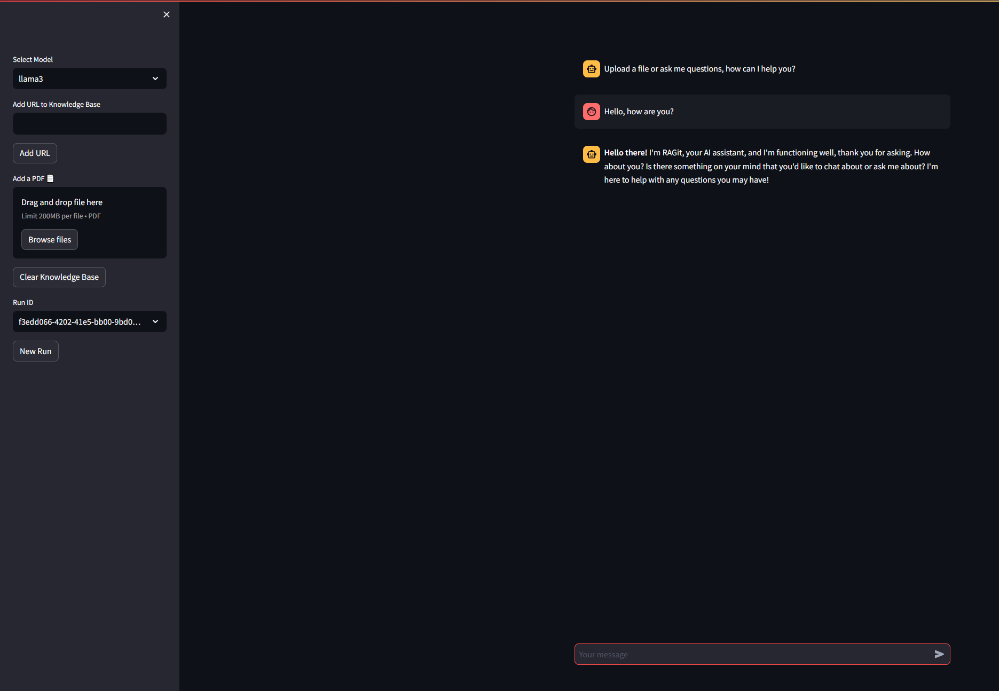

# Local LLM with Ollama & PgVector 🤖
Credits go to Phidata for providing local rigging scripts and repository.<br/>
Link to [Llama-3-8B](https://huggingface.co/meta-llama/Meta-Llama-3-8B) 🦙<br/>
Link to [Llama-3-70B](https://huggingface.co/meta-llama/Meta-Llama-3-70B) 🦙🔥

### 1. [Install](https://github.com/ollama/ollama?tab=readme-ov-file#macos) Ollama and run model

Install Ollama

```shell
curl -fsSL https://ollama.com/install.sh | sh
```

Run and pull manifest of your preferred Llama3 model

```shell
ollama run llama3 'Hey!'
```

- And/or Llama3 70b

```shell
ollama run llama3:70b 'Hey!'
```

You can find more LLM's [here](https://ollama.com/library), adjust app.py accordingly.

### 2. Create a virtual environment

```shell
python3 -m venv ~/.venvs/aienv
source ~/.venvs/aienv/bin/activate
```

### 3. Install libraries

```shell
pip install -r package.txt
```

### 4. Run PgVector

> Install [docker desktop](https://docs.docker.com/desktop/install/mac-install/)

- Run using this script

```shell
docker run -d \
  -e POSTGRES_DB=ai \
  -e POSTGRES_USER=ai \
  -e POSTGRES_PASSWORD=ai \
  -e PGDATA=/var/lib/postgresql/data/pgdata \
  -v pgvolume:/var/lib/postgresql/data \
  -p 5532:5432 \
  --name pgvector \
   phidata/pgvector:16
```

### 5. Run RAG app

```shell
streamlit run app.py
```

- Open [localhost:8501](http://localhost:8501) to view your local RAG app.<br/>

